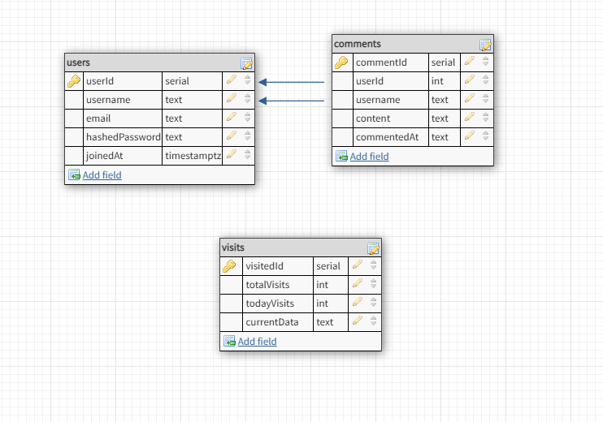
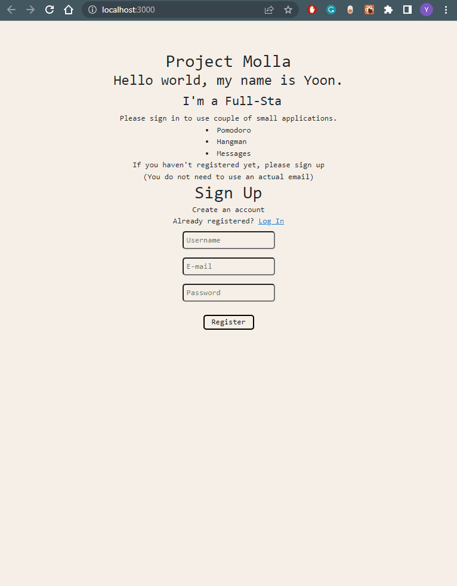
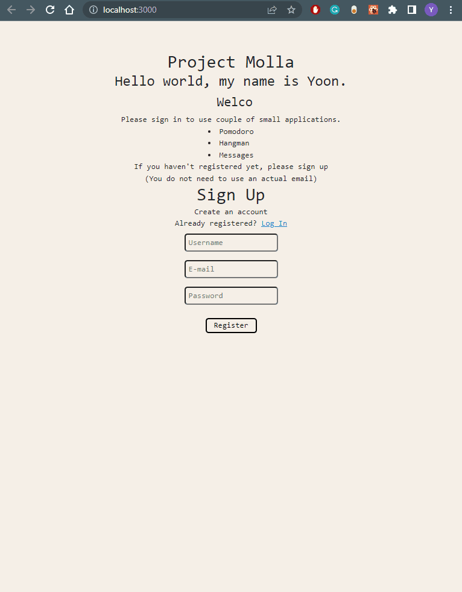
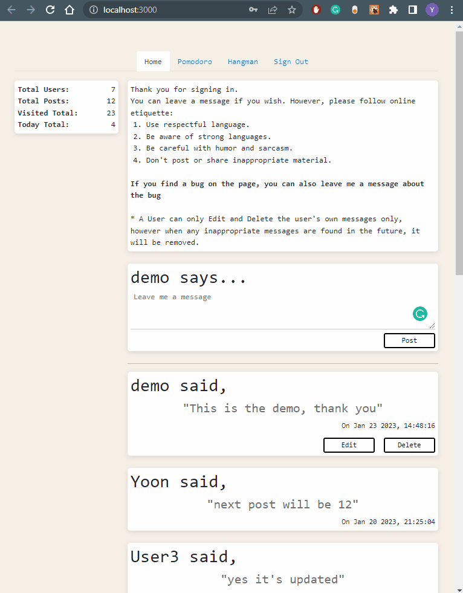
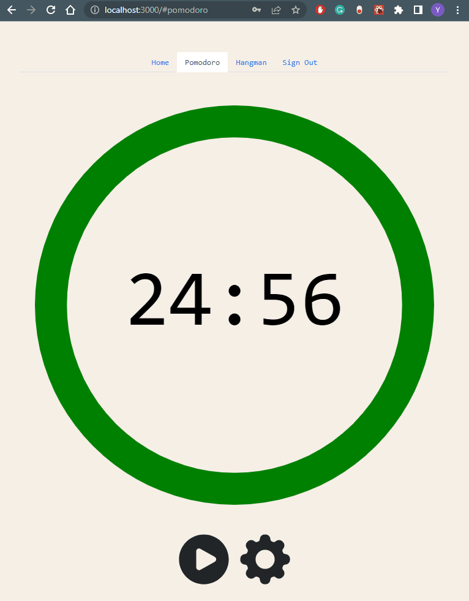

# Table of Contents

- [Yoon's 3-in-1](#travel-map-journal-computer)
- [Why I Built This](#why-i-built-this-bulb)
- [Technologies Used](#technologies-used-technologist)
- [Features](#features-memo-pencil)
- [App Preview](#app-preview-mag)
- [Other Requirement](#other-requirement-gear)
- [Getting Started](#getting-started-zap)

# Yoon's 3-in-1 :computer:

A Full-Stack Web Application with pomodoro, hangman, and forum like page.

# Why I Built This :bulb:

This is my first project outside of coding bootcamp. I wanted to build something on my own without using the dev environment from the bootcamp.

# Technologies Used :technologist:

- UI Framework: **React**
- JavaScript Runtime: **Node.js**
- Server Framework: **Express**
- Database: **PostgreSQL**
- Languages: **JavaScript (ES6)**, **HTML5**, **CSS3**, **SQL**

### Database Schema



# Features :memo::pencil:

- User can register and/or sign-in to navigate the web application
- User can use other apps:
  - Home:
    - User can read all the messages from all users
    - User can add messages
    - User can edit own messages
    - User can delete own messages
  - Pomodoro:
    - Can set the study/break time
    - Plays a sound once the clock is a zero
  - Hangman:
    - Play hangman with random word generate

# App Preview :mag:

### Register & Sign-in

- User can register with a new username (unique and case sensitive), email, and password. If the registration is successful, page will redirect the user to "sign in" section.

- Type in the username and password to sign in.

- Once the user is signed in, user has access to Home, Pomodoro, and Hangman.



---

- App will let the user know if there are errors:

  - During registration: due to a username being already taken
  - During sign in: due to invalid username/password



---

### Home

- To leave a meaage click on the "Leave me a message", fill out the textarea, and click on post.
- One posted, on the bottom right of the post there is date and time of when it was posted.
- User can edit or delete the user's messages only and do not have access to do the same to the other user's messages.


---

### Pomodoro

- Click on play button to start the time. Once the study time reaches 00:00, it will play a sound and switch to break time. Once the break time reaches 00:00, it will play a sound again and switch back to study time.

- Click on setting button and can change the study time and break time (study and break time is in minutes).



---

### Hangman

- Click any letters to pick a letter:

  - If a letter is in a word, button will turn green
  - If a letter isn't in a word, button will turn red and draw a portion of hangman.

- End of the game, click on new game button to get a random word to play hangman again.



---

# Other Requirement :gear:

- PostgreSQL (v15.1) https://www.postgresql.org/download/
- Random Word API Key https://api-ninjas.com/api/randomword

# Getting Started :zap:

Since I am a Windows users, this setup is for windows user only. For Mac users, I apologize, I did not add one since I don't have have a way to test it and to give instructions.

1. Clone repository.

   `https://github.com/YoonHCho/personal-project`

2. Install dependencies in `package.json` with npm.

   `npm install`

3. Download PostgreSql. Go to https://www.postgresql.org/download/windows/ click on "Download the installer" and on the row for version 15.1, click on the download for Windows.

4. Install the PostgreSql and follow the Setup prompt. Once you are at:

- "Password" section, type in the password and remember it. Also, as you read this section of the Setup, superuser is "postgres" which will be your username for PostgreSQL. Hit next
- "Port" section, port number should be 5432, and leave as is. Hit next
- "Advanced Options" section, in locale, defaul should be "[Default locale]" and leave as is. Hit next and let it install.
- Uncheck the "Launch Stack Bilder". Hit finish

5. Set environment variable. Example, My address was C:\Program Files\PostgreSQL\15\bin

- Click on Windows and type in environment variable, it should have a result for "Edit the system environment variable" and click on it.
- [You can watch the tutorial](https://www.youtube.com/watch?v=3GWZUNCDqNo)

- Once you have done this, you should be able to connect to PostgreSQL.

7. Log in to Postgres from VS code terminal using `psql -U postgres` and when asked for password, type in the password you setup while installing PostgreSQL.

8. Once logged in, create the database replace `nameOfDatabase` with the actual name.

   ```
   createdb -U postgres nameOfDatabase
   ```

   To see the database is created use `\l` Then go into the database use `\c nameOfDatabase`

9. Create Tables. Need to create 3 tables. copy and past following 1 for each table. If table was created successfully, terminal will output "CREATE TABLE" after you paste and hit enter for each table

   first

   ```
   CREATE TABLE users (
     userId SERIAL PRIMARY KEY,
     username TEXT UNIQUE NOT NULL,
     email TEXT NOT NULL,
     hashedPassword TEXT NOT NULL,
     joinedAt TIMESTAMP WITH TIME ZONE NOT NULL DEFAULT CURRENT_TIMESTAMP
   );
   ```

   second

   ```
   CREATE TABLE comments (
     commentId SERIAL PRIMARY KEY,
     userId INT NOT NULL,
     username TEXT NOT NULL,
     comments TEXT NOT NULL,
     commentedAt TEXT NOT NULL,
     FOREIGN KEY(userId)
       REFERENCES users(userId),
     FOREIGN KEY(username)
       REFERENCES users(username)
   );
   ```

   third

   ```
   CREATE TABLE visits (
     visitId SERIAL PRIMARY KEY,
     totalVisits INT NOT NULL,
     todayVisits INT NOT NULL,
     currentDate TEXT NOT NULL
   );
   ```

   then insert a row of default data into table visits. If the data was successfully inserted, should output "INSERT 0 1". For MMMDDYYYY use the first three letter of the month (first letter capitalized). example: if today was January 23, 2023 should be Jan232023.

   ```
   INSERT INTO "visits" ("totalvisits", "todayvisits", "currentdate")
   VALUES (0, 0, 'MMMDDYYYY');
   ```

10. Create a `.env`, should be placed same as `.env.example` and update the environment variable in the `.env` file (replace the the text in brackets( [ ] ) from below example).

    `REACT_APP_RANDOM_WORD_API=[Random-word-API-Key-Here]`

    `TOKEN_SECRET=[someRandomValue12345]`

    `PG_PSW=[yourPostgresPassword]`

    `PG_DATABASE=[nameOfYourDatabase]`

    `PGUSER=[yourPostgresUsername]`

11. Split VS Code terminal so you have two terminals. in one type and enter `npm run start` and on other type and enter `npm run dev` to start the application.

12. App should open browser automatically and be viewable in your browser at `http://localhost:3000`

13. Enjoy the app 😁

[Back To The Top](#table-of-contents)
